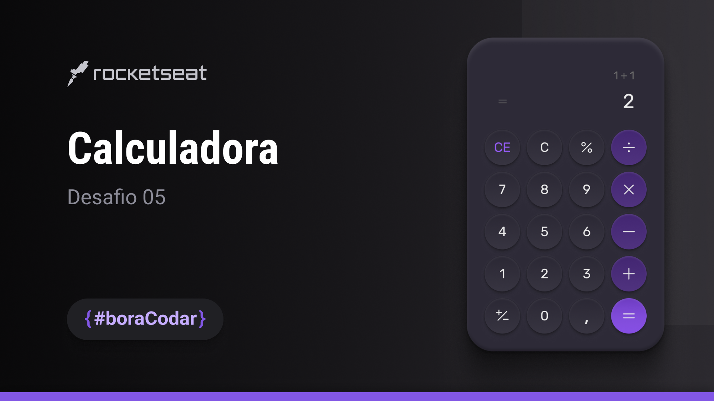

<h1 align="center"> Desafio 5 BoraCodar </h1>

##  Tecnologias

Esse projeto foi desenvolvido com as seguintes tecnologias:

- HTML e CSS
- Git e Github
- Figma
- JavaScript
- Phosphoricon

##  Layout

Você pode visualizar o layout do projeto através [DESSE LINK](https://www.figma.com/community/file/1202607074523509182). 

 

  

## Sobre
 Se apertar um operador matematico (+, -, %, *, /) árias vezes, ele repetirá os números e as operações. Por exemplo, 2x2 = 4 - 4x4 = 16 - 16x16 =256 outro exemplo 2+2=4 - 4+4=8 - 8+8=16 - 16+16=32 - 32+32=64
 
 Ela tambem não salva os numeros digitados na tela e os operadores matematicos não aparecem na tela como no projeto do figma. Por ultimo os botoes tem dois que desempenham a mesma função (CE e C) e um que eu não sei como funciona (+/-) então não tem funcionalidade. 
